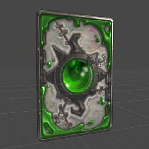
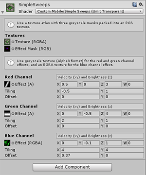

# Simple Sweeps
#### A mobile-focused shader with composited UV animations.

* Unity Version: 5.3+
* Example Project: 5.4.0 b20

### Features
* Accepts an image atlas and mask atlas to control the effect composites.
* Uses up two greyscale Alpha textures for an additive composite sweeping across via `_Time`.
* Uses an additional RGBA texture for an alpha-blended UV translation via `_Time`.

### Remarks

This shader was developed rapidly in a triage process, aimed to provide the art team with the means of quickly animating two single-channel wiping light cookies and one RGB scrolling texture, targeting numerous prop and hero-prop assets. The triage process was performed with a very constrained scope, so this was developed with numerous internal design considerations in mind.

Ultimately, draw calls and overdraw had to remain as low as possible as we were targeting as low as the iPhone 4. This tool was created with atlasing (animating numerous textures) in mind, as well as using the shader as a compositing tool to prevent unnecessary overdraw with overlaying effects and textures.

This shader originally came in two variants (another design constraint applied by triage): one for 2D assets with transparency, and another for 3D objects without transparency. This sample provides the 2D variant.

It provides controls via LUT to access and animate additive masks using `_Time` variables.

# License

Copyright (C) 2016 Dan Peavey

> Permission is hereby granted, free of charge, to any person obtaining a copy of this software and associated documentation files (the "Software"), to deal in the Software without restriction, including without limitation the rights to use, copy, modify, merge, publish, distribute, sublicense, and/or sell copies of the Software, and to permit persons to whom the Software is furnished to do so, subject to the following conditions:   
> The above copyright notice and this permission notice shall be included in all copies or substantial portions of the Software.   
> THE SOFTWARE IS PROVIDED "AS IS", WITHOUT WARRANTY OF ANY KIND, EXPRESS OR IMPLIED, INCLUDING BUT NOT LIMITED TO THE WARRANTIES OF MERCHANTABILITY, FITNESS FOR A PARTICULAR PURPOSE AND NONINFRINGEMENT. IN NO EVENT SHALL THE AUTHORS OR COPYRIGHT HOLDERS BE LIABLE FOR ANY CLAIM, DAMAGES OR OTHER LIABILITY, WHETHER IN AN ACTION OF CONTRACT, TORT OR OTHERWISE, ARISING FROM, OUT OF OR IN CONNECTION WITH THE SOFTWARE OR THE USE OR OTHER DEALINGS IN THE SOFTWARE.
